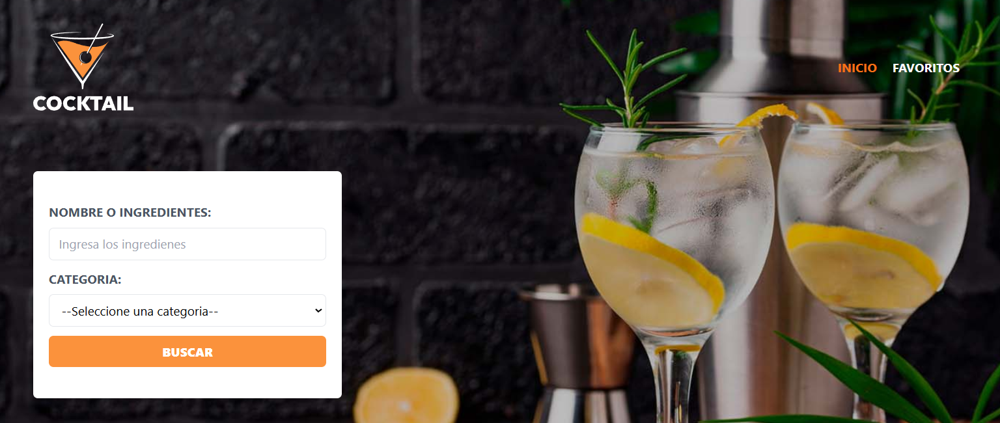

<!-- Banner -->


# 🍸 Proyecto: Buscador de Recetas de Bebidas

¡Gracias por visitar mi proyecto! Esta aplicación te permite buscar y explorar recetas de bebidas de manera fácil y rápida. Utiliza la API de [TheCocktailDB](https://www.thecocktaildb.com/) para ofrecer una amplia variedad de recetas de cócteles, con instrucciones detalladas y listas de ingredientes.

## 🛠️ Tecnologías Utilizadas

- **React**: Librería para la construcción de interfaces de usuario.
- **React Router DOM**: Manejo de rutas para navegar entre las diferentes secciones de la aplicación.
- **TypeScript**: Superset de JavaScript que añade tipos estáticos, mejorando la robustez del código.
- **Zustand**: Biblioteca ligera para el manejo del estado global de la aplicación.
- **Zod**: Librería para la validación de esquemas de datos.
- **Axios**: Cliente HTTP para realizar peticiones a la API de TheCocktailDB.
- **Tailwind CSS**: Framework CSS para crear estilos rápidos y modernos.
- **React Toastify**: Biblioteca para mostrar notificaciones elegantes y personalizables.
- **Local Storage**: Almacenamiento local para guardar las recetas favoritas del usuario.
- **Headless UI**: Componentes accesibles y sin estilos para crear modales y otros elementos interactivos.

## 🌐 Prueba la Aplicación

Puedes probar la aplicación en vivo en [este enlace de Netlify](https://app-bebidasts.netlify.app/).

## 📝 Funcionalidades Principales

- **Búsqueda de Recetas de Bebidas**: Encuentra recetas utilizando el nombre de la bebida o un ingrediente.
- **Detalle de Recetas**: Visualiza ingredientes, instrucciones, y otra información relevante de cada bebida.
- **Favoritos**: Guarda tus recetas favoritas en Local Storage para acceder a ellas en cualquier momento.
- **Modal Interactivo**: Utiliza Headless UI para mostrar detalles de recetas en un modal atractivo y fácil de usar.
- **Notificaciones**: Muestra alertas y mensajes al usuario mediante React Toastify.

## 📂 Estructura del Proyecto

```bash
src/
├── components/       # Componentes reutilizables
├── layouts/          # Layout Principal
├── pages/            # Páginas de la aplicación
├── schemas/          # Esquemas de los datos con Zod
├── services/         # Configuración de Axios y lógica de conexión a la API
├── store/            # Configuración de Zustand para el manejo de estado
└── types/            # Definiciones de tipos para TypeScript
```
## 🚀 Cómo Empezar
1. Clona el repositorio:

```bash
git clone https://github.com/RodrigoLoboDev/APP-Bebidas
```
2. Instala las dependencias:

```bash
npm install
```

3. Inicia el servidor de desarrollo:

```bash
npm run dev
```

## 🤝 Contribuciones
Las contribuciones son bienvenidas. Si tienes ideas para mejorar el proyecto, no dudes en abrir un issue o hacer un pull request.

## 📧 Contacto
- Email: rolobo2812@gmail.com
- LinkedIn: [Jesús Luis Rodrigo Lobo](https://www.linkedin.com/in/jes%C3%BAs-luis-rodrigo-lobo-6594a81b4/)
- GitHub: [RodrigoLoboDev](https://github.com/RodrigoLoboDev)

#### ⭐️ Si te gusta lo que hago, no dudes en seguirme y contribuir a mis proyectos. ⭐️